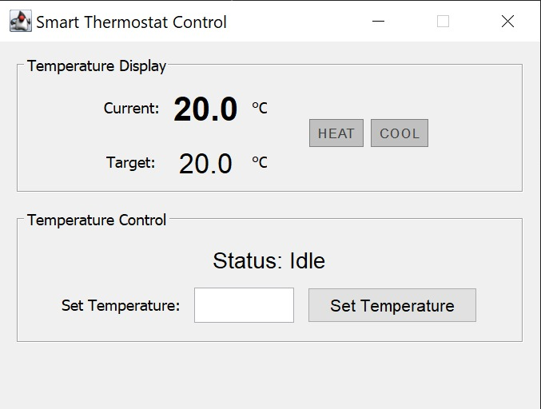
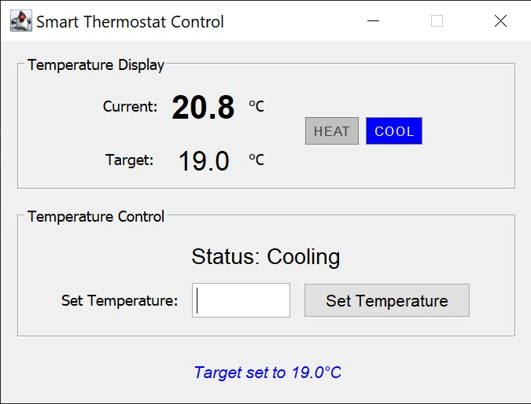
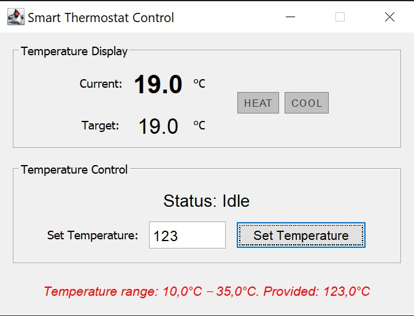

# Smart Thermostat Control System

A Java Swing application demonstrating the Model-View-Controller (MVC) design pattern with comprehensive unit testing.

## 📋 Overview

This project implements a smart thermostat control system that allows users to set target temperatures and monitor heating/cooling status. The application showcases professional software engineering practices including:

- Clean MVC architecture
- Interface-based design
- Comprehensive unit testing with mocks
- Input validation and error handling
- Internationalization support (comma/period decimal separators)

<table align="center">
  <tr>
    <td align="center" style="padding: 10px;">
       
      <strong>Idle</strong>
    </td>
    <td align="center" style="padding: 10px;">
       
      <strong>Heating</strong>
    </td>
  </tr>
  <tr>
    <td align="center" style="padding: 10px;">
       
      <strong>Cooling</strong>
    </td>
    <td align="center" style="padding: 10px;">
       
      <strong>Error</strong>
    </td>
  </tr>
</table>

## 🏗️ Architecture

The application follows the MVC pattern with clear separation of concerns:  
src/  
├── model/  
│   ├── IThermostatModel.java      # Model interface  
│   └── ThermostatModel.java       # Business logic implementation  
├── view/  
│   ├── IThermostatView.java       # View interface  
│   └── SwingThermostatView.java   # Swing GUI implementation  
├── controller/  
│   ├── IThermostatController.java # Controller interface  
│   └── ThermostatController.java  # Controller implementation  
└── ThermostatApp.java             # Application entry point  
test/  
├── model/  
│   └── ThermostatModelTest.java   # Model unit tests  
└── controller/  
└── ThermostatControllerTest.java # Controller tests with mocks

## 🚀 Features

- **Temperature Control**: Set target temperature with 0.1°C precision
- **Automatic Climate Control**: Heating/cooling activates based on current vs target temperature
- **Visual Indicators**: Real-time status display for heating/cooling states
- **Input Validation**: 
  - Temperature bounds checking (10°C - 35°C)
  - Decimal precision validation (0.1°C increments)
  - Number format validation
- **Internationalization**: Accepts both comma and period as decimal separators
- **User Feedback**: Clear success/error messages with auto-dismiss

## 🛠️ Technologies

- **Java 23** (JDK 23)
- **Swing** - GUI framework
- **JUnit 5** - Testing framework

## 💡 Usage

Launch the application - The thermostat window will appear  
View current temperature - Displayed in the top panel  
Set target temperature:  
  
Enter desired temperature (10°C - 35°C)  
Click "Set Temperature"  
System will automatically heat or cool to reach target  
  
Monitor status - Watch the HEAT/COOL indicators and status text  
  
Valid Input Examples:  
  
20 → 20.0°C  
20.5 → 20.5°C  
20,5 → 20.5°C (European format)  
  
Invalid Input Examples:  
  
abc → "Please enter a valid number"  
50 → "Temperature must be between 10.0°C and 35.0°C"  
20.55 → "Temperature must be in 0.1°C increments"  
  
## 🔮 Future Enhancements

Features:
- Add temperature history graph
- Save/load temperature settings
- Add scheduling (different temps at different times)
- Add temperature units toggle (°C/°F)
- Energy Usage Tracking (monitor and display energy consumption statistics)

Advanced Testing:
- Integration tests (real Model + Controller + Mock View)
- UI tests with AssertJ Swing
