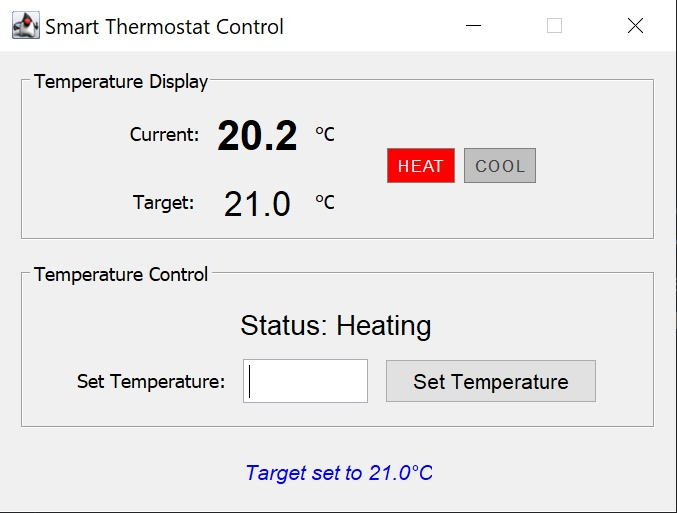

# Thermostat Control System

A Java Swing application demonstrating clean MVC architecture with comprehensive unit testing and professional software engineering practices.

**Architecture & Design**

- Clean **MVC architecture**
- **Interface-based design**
- **Input validation and error handling**
- Best Practices: **SOLID principles**, **clean code**

**Testing Strategy**
- Comprehensive **unit testing** (model)
- **Mock testing** (controller)

<table align="center">
  <tr>
    <td align="center" style="padding: 10px;">
      <br/>
      <strong>Idle</strong>
    </td>
    <td align="center" style="padding: 10px;">
      <br/>
      <strong>Heating</strong>
    </td>
  </tr>
  <tr>
    <td align="center" style="padding: 10px;">
      <br/>
      <strong>Cooling</strong>
    </td>
    <td align="center" style="padding: 10px;">
      <br/>
      <strong>Error</strong>
    </td>
  </tr>
</table>

## 🎮 How to Use
Temperature Control

- Launch: Run ThermostatApp.java
- Set target: Enter temperature (10°C - 35°C) and click "Set Temperature"
- Monitor: Watch HEAT/COOL indicators and status display
- System automatically maintains target temperature

**Input Examples**

- Valid: 20, 20.5, 20,5 (European format)  
- Invalid: abc, 50, 20.55 (not in 0.1°C increments)  

## 🚀 Features

- **Temperature Control**: Set target temperature with 0.1°C precision
- **Automatic Climate Control**: Heating/cooling activates based on current vs target temperature
- **Visual Indicators**: Real-time status display for heating/cooling states
- **Input Validation**: 
  - Temperature bounds checking (10°C - 35°C)
  - Decimal precision validation (0.1°C increments)
  - Number format validation
- **Internationalization**: Accepts both comma and period as decimal separators
- **User Feedback**: Clear success/error messages with auto-dismiss

## 🏗️ Architecture

The application follows the MVC pattern with clear separation of concerns:  

```bash
src/  
├── model/  
│   ├── IThermostatModel.java      # Model interface  
│   └── ThermostatModel.java       # Business logic implementation  
├── view/  
│   ├── IThermostatView.java       # View interface  
│   └── SwingThermostatView.java   # Swing GUI implementation  
├── controller/  
│   ├── IThermostatController.java # Controller interface  
│   └── ThermostatController.java  # Controller implementation  
└── ThermostatApp.java             # Application entry point  
test/  
├── model/  
│   └── ThermostatModelTest.java   # Model unit tests  
└── controller/  
└── ThermostatControllerTest.java  # Controller tests with mocks  
```

## 🛠️ Technologies

- **Java 23** (JDK 23)
- **Swing** - GUI framework
- **JUnit 5** - Testing framework
  
## 🔮 Future Enhancements

Features:
- Add temperature history graph
- Save/load temperature settings
- Add scheduling (different temps at different times)
- Add temperature units toggle (°C/°F)
- Energy Usage Tracking (monitor and display energy consumption statistics)
